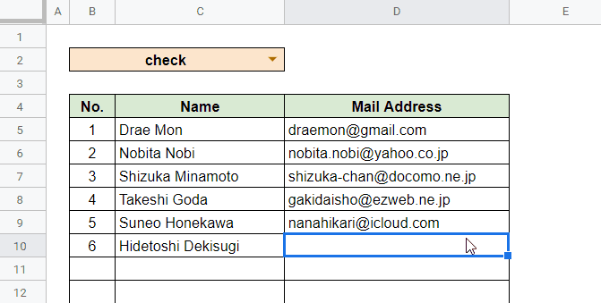

# gae-gas-test

This repository stores sample application that interacts between Google App Engine (GAE) and Google Apps Script (GAS).

## Feature Orverview

* When user edits the spreadsheet, the script (GAS) is invocated.
* The script (GAS) calls API on GAE with SpreadsheetID and the sheet name.
* GAE validates the sheet values (Mail Address).
* If error occurred, GAE returns error message. If not, returns empty.
* If a message is in the response, the script display that message on a dialog.



## Build and Deploy

### Google App Engine (GAE)

1. Create `secret.yaml` like below.
  You need to get Google OAuth credentials and token in advance.

  ```yaml
  env_variables:
    OAUTH_CREDENTIALS: 'xxx'
    OAUTH_TOKEN: 'xxx'
  ```

2. Deploy application to GAE.

  ```bash
  gcloud app deploy
  ```

### Google Apps Script (GAS)

1. Create the sheet.
1. Copy and paste `gas/main.gs` to Script Editor.
1. Add trigger to `onEditInstalled` function.
1. Approve on a Google OAuth consent screen.
